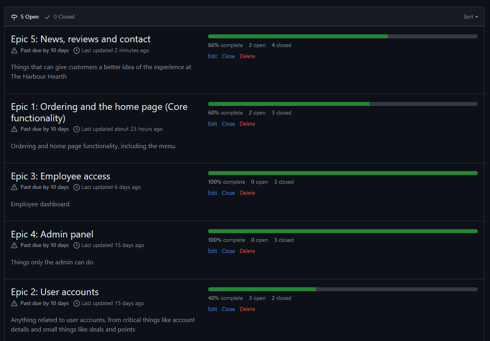

# The Harbor Hearth
### Set sail for deliciousness

[Deployed website](https://zoten64-the-harbour-hearth-cd54b5ce5a13.herokuapp.com/)

## Table of Contents:

* [Goals and target audience](#goals-and-target-audience)
* [User stories](#user-stories)
* [Epics](#epics)
* [Progress](#progress-documentation)
* [Design](#design)
* [Wireframes](#wireframes)
* [User Manual](#user-manual)
* [Features](#features)
* [Bugs and fixes](#bugs-and-fixes)
* [Technologies and tools](#technologies-and-tools)
* [Technical Design](#technical-design)
* [Validation and testing](#validation-and-testing)
* [Deployment](#deployment)
* [Credits](#credits)

# Goals and target audience

The goal of this project is to put my knowledge of HTML, CSS, JS, Python, Django and relational databases as well 
as push myself to learn more.

The Harbor Hearth is a fictional bistro nearby a vacation resort located at the west coast of England. They offer online ordering and a digital menu. Clients can
review the bakery, create an account to be recieve loyalty points with every order that can be exchanged for goods. Making an account will also let you take part of deals
and save your payment information for faster ordering. Though an account is not required for ordering as that may be frustrating for users.

The website also features a blog where the admins can post news, changes and other relevant information. 

As an admin you can create special accounts for employees where they have access to a page with pending orders with the ability to cancel. They also have access to answer and approve questions as well as delete inappropriate ones. 

# User stories

### Customer

1. As a customer I can view the menu online so I can see what is available to order
    - AC1: There should be an easy way to access the menu online
    - AC2: Prices should be shown alongside items in a clear way
    - AC3: Items should be sorted into categories for easier navigation

    Must have

2. As a customer with dietary restrictions I can easily identify what I can and cannot eat so that I can avoid eating things I shouldn't
    - AC1: Common allergies should be clearly marked on the menu (Lactose, nuts, gluten, eggs)
    - AC2: Vegan items are clearly marked for easier identification
    - AC3: Ingredients should be listed

    Must have

3.  As a customer I can order online so I don't have to wait in line at the counter to do so
    - AC1: The website should have an option to order
    - AC2: The customer should be given a short and easy to remember order number

    Must have

4. As a customer I can choose to have my order be eat-in or take-out to suit my needs
    - AC1: The customer should be able to choose eat-in or take-out

    Must have

5. As an eat-in customer I can choose to have my order brought to my table or to pick it up myself at the counter to better suit my needs
    - AC1: Customers who choose the eat in option should have the option to pick up at the counter or brought to the table
    - AC2: The customer should have to enter their table number

    Must have

6. As a customer I can scan a QR code at my table to be instantly taken to the order page with my table number to make it more convenient to order
    - AC1: QR codes should take the customer to the order page
    - AC2: The table number associated with the QR code should be already filled in at the delivery method page
    - AC3: The customer should be able to change the table number and delivery method in case they change their mind or the number is wrong

    Could have

7. As a new customer I can see reviews so I can get a better idea of the experience at the bistro
    - AC1: A preview of reviews should be displayed on the home page with a link to a full page of all the reviews
    - AC2: Reviews should be able to be filtered

    Should have

8. As a customer I can create an account so I can access more features
    - AC1: Customer should be able to make an account
    - AC2: Customer should have to verify their email

    Must have

9. As a customer with an account I can log in so I can access more features
    - AC1: Customer should be able to log in

    Must have

10. As a logged in customer I can change account details so that I can keep using it:
    - AC1: Customer should be able to change email
    - AC2: A changed email should require verification of the new one
    - AC3: Customer should be able to change password
    - AC4: Customer should be able to change name

    Must have

11. As a logged in customer I can delete my account so that my info is no longer stored in The Harbor Hearths database
    - AC1: Customer should have access to a delete button on their account page
    - AC2: Customer should be informed that the account deletion is permanent
    - AC3: Customer should be prompted to confirm deletion

    Must have

12. As a customer who forgot their password I can request a password reset to be able to regain access to my account
    - AC1: The customer should recieve an email with instructions on how to reset their password
    - AC2: Password reset should be successful

    Should have

13. As a logged in customer I can write a review about my experience at the bistro so others can get a better idea of what it's like
    - AC1: The review should have a star rating (1-5)
    - AC2: The review should have a title and some text content (restructed to 3000 characters or less)
    - AC3: The review should offer the option to add up to 4 images

    Should have

14. As a logged in customer who has written a review I can change it to make it more accurate
    - AC1: Customer should be able to change the title of their review
    - AC2: Customer should be able to change the content of their review
    - AC3: Customer should be able to add/remove images from their review

    Should have

15. As a logged in customer I can earn points from each order so that I can be rewarded for coming back
    - AC1: Customer should be awarded points with each order that are stored in the account
    - AC2: Customer should be able to exchange a number of points for free items

    Won't have

16. As a logged in customer I can access deals to make my order cheaper or more beneficial
    - AC1: Logged in customer should be able to choose a deal when ordering

    Won't have

17. As a logged in customer I can add and delete my payment information for quicker ordering next time
    - AC1: Payment info MUST be stored in a secure and encrypted manner
    - AC2: Payment info should be able to be retrieved and work
    - AC3: Payment info should be able to be added
    - AC4: Payment info should be able to be deleted

    Won't have
    Note: Customers can pay at the counter before leaving until this can be implemented

18. As a customer I can contact the Harbor Hearth using a form on their website so I can have any inquires answered
    - AC1: The form should work 
    - AC2: A confirmation email should be sent to the customer upon submission

    Could have

### Employee

19. As an employee I can view orders made by customers so that I can serve them
    - AC1: Website should have a separate page, accessable only to employees and the owner, where a list of customer orders can be viewed
    - AC2: Orders should expire and be archived after a certain amount of time
    
    Must have

20. As an employee I can cancel inapporpriate orders so that I don't have to serve them
    - AC1: Employee's should be able to view an order and be able to delete it.
    - AC2: Employee should be prompted to confirm the deletion
    - AC3: An email should be sent to the person who ordered explaining why

    Should have

21. As an employee I can see a list of questions and messages submitted by customers through the contact form so that I may assist them
    - AC1: The employee only part of the website should feature a page where employees can answer questions
    - AC2: The answer should be sent to the customer via email

    Could have

### Admin

22. As an administrator I have access to an admin dashboard so I can manage the data on the site
    - AC1: The Django admin dashboard should have all models registered
    - AC2: The administrator should be able to delete and add data
    
    Must have

23. As an administrator I can create employee accounts so I can grant them access to specific features
    - AC1: The Django admin dashboard should have an option called "employee account" when creating/changing an account

    Must have

24. As an administrator I can create formatted blog posts of news and important information so I can keep my customers updated
    - AC1: The administratot creating a blog post should allow the use of HTML formatting

    Should have

25. As an administrator I can easily change the price of items on the menu so that I can keep it up to date
    - AC1: The administrator should be able to change the prices from the admin panel

    Must have

26. As an administrator I can easily add and remove items from the menu
    - AC1: The administrator should be able to add and remove items in the admin panel

    Must have

# Epics

1. Ordering and the home page (Core functionality)
    - Ordering and home page functionality, including the menu.
    - User Story Numbers: 1, 2, 3, 4, 5, 6

2. User accounts
    - Anything related to user accounts, from critical things like account details and small things like deals and points
    - User Story Numbers: 8, 9, 10, 11, 12

3. Employee access
    - Employee dashboard
    - User Story Numbers: 19, 20, 23

4. Admin panel
    - Things only the admin can do
    - User Story Numbers: 22, 25, 26

5. News, reviews and contact
    - Things that can give customers a better idea of the experience at The Harbour Hearth
    - User Story Numbers: 7, 13, 14, 18, 21, 24

# Progress Documentation

Here I will document the progress divided into specific dates. Please note that all workdays may not be documented

 Progress 23/04/2024 

**Milestones/epics progress**

**Backlog**

**Commentary:**

Milestones have been created in github. Some of the user stories were changed, added and deleted because of plan changes. The plans to create a forum like page for questions and answers were switched out in favor of a contact form to have less clutter.

 Progress 7/05/2024 

**Milestones/epics progress**

**Backlog**

**Commentary:**

Home page has been finished and the menu page has been made. I still need to add most of the links and then work on the employee side of the website as it is different from the admin site

 Progress 10/05/2024 

**Milestones/epics progress**

**Backlog**

**Commentary:**
Blog page has been finished and viewing reviews is now possible. Clicking on a review/blog preiew brings you to the full page with the details. Works on both the list pages and the home page. Account authentication has been set up and so has email verification and password reset.

 Progress 24/05/2024 

**Milestones/epics progress**

**Backlog**

**Commentary:**
A lot has been done since the last update. Users can now order and send contact forms, employees can now view orders and contact forms, change order status, cancel orders, delete cancelled orders and answer contact forms. Reviews still needs to be done and the order page needs javascript functionality added to it and card information needs to be stored and retrieved when needed. A lot of things still needs a bunch of styling. 

Summernote has been added to the admin page for blog posts. 

 Progress 26/05/2024 

**Milestones/epics progress**

**Backlog**

**Commentary:**
All the user stories have been completed

# Design

# Wireframes

# User manual

# Features

# Bugs and fixes

| Bug | Fix |
-------------
| "Cannot import name Menu from home.models" error after the menu model has been moved | Remove the Menu import in home/views.py and home/urls.py. Remove the home urls from the main urls file |
| Django looks for home index template in the wrong folder | Change views path to home/index.html |
| Template functions displaying as example { % block content % } instead of displaying the actual block content| Remove spaces between {} and % |
| The resource from “http://127.0.0.1:8000/css/style.css” was blocked due to MIME type (“text/html”) mismatch (X-Content-Type-Options: nosniff) | Wrong path specified as CSS stylesheet |
| "relation [model] does not exist" error | Make a new database as the last one stopped working properly and I couldn't figure out why. Not a big deal since it was all placeholder content|
| review model submits duplicate upon page reload | Create an extra check to make sure that the user has not sent a review before creating the object in the database and reload the page |
| Order not placing if the user is logged in | Change the way valid forms are checked. Email validity is only checked if the user is not logged in |
| Orders not showing up if the user places them | explicitly declare the order state as "not started" |

# Technologies and tools

### Languages
- HTML
- CSS
- JavaScript
- Python

### Tools
- Visual Studio Code
- Git
- Github
- Heroku
- Pip

### Pyton Libraries
**Built in:**

- OS
    - Used to make environmental variables and to import them
- Pathlib
    - For dynamic paths. 

**3rd Party:**

- Django
    - Backend is built using Django
- dj-database-url
    - Used to parse the database access url for use within the application
- gunicorn
    - HTTP Server for Heroku deployment
- asgiref
    - Django dependency
- packaging
    - Dependency for gunicorn
- psycopg2
    - Driver to connect to the database 
- sqlparse
    - Django dependency
- typing_extensions
    - Dependency for dj-database-url
- tzdata
    - Django dependency

**Note:**

pipdeptree was used to get a better look at the relationship between libraries and therefor not used in the code itself

### Frontend libraries

- Tailwind
    - Used to quickly build the UI
- Flowbite
    - Open source components

# Technical design

# Validation and testing

## HTML (W3C Validator)

 Home 

 Menu 

 Reviews 

 Contact 

 Blog 

 Log in 

## CSS Jigsaw Validator

 CSS Jigsaw 

## JSHint

 JSHint 

# Deployment

# Credits

**Code**

- [Codestar walkthrough project has been referenced in a lot of places](https://github.com/Code-Institute-Solutions/blog/tree/main/15_testing)
- [Love running project for social media link help](https://github.com/Code-Institute-Solutions/love-running-v3/blob/main/8.1-testing-and-validation/index.html)
- [Django documentation](https://docs.djangoproject.com/en/5.0/)
- [Tailwind documentation](https://tailwindcss.com/docs/installation)
- [Flowbite dropdown menu](https://flowbite.com/docs/components/dropdowns/)
- [Flowbite tabs menu](https://flowbite.com/docs/components/tabs/)
- [Flowbite carousel for reviews and news section](https://flowbite.com/docs/components/carousel/)
- [Success message after post](https://stackoverflow.com/questions/28723266/django-display-message-after-post-form-submit)
- [Login always throwing "wrong password or email" error issue fix](https://stackoverflow.com/questions/27967319/django-allauth-email-login-always-wrong)
- [Django summernote implementation tutorial](https://github.com/summernote/django-summernote)
- Various snippets from other personal projects to speed up the process

**Assets**

- [Logo, modified in inkscape](https://www.freepik.com/free-vector/hand-drawn-beach-logo-template_26252522.htm#query=ocean%20logo&position=16&from_view=keyword&track=ais_user&uuid=7f17a4dc-ae89-4548-95a0-02b50afd77e2)
- [Hero Image by StockSnap at StockVault](https://www.stockvault.net/photo/190026/dock#)

**Inspiration**

- [Landing page UI inspiration](https://www.behance.net/gallery/196798485/Restaurant-landing-page-UI-design?tracking_source=search_projects|restaurant+ui&l=37)